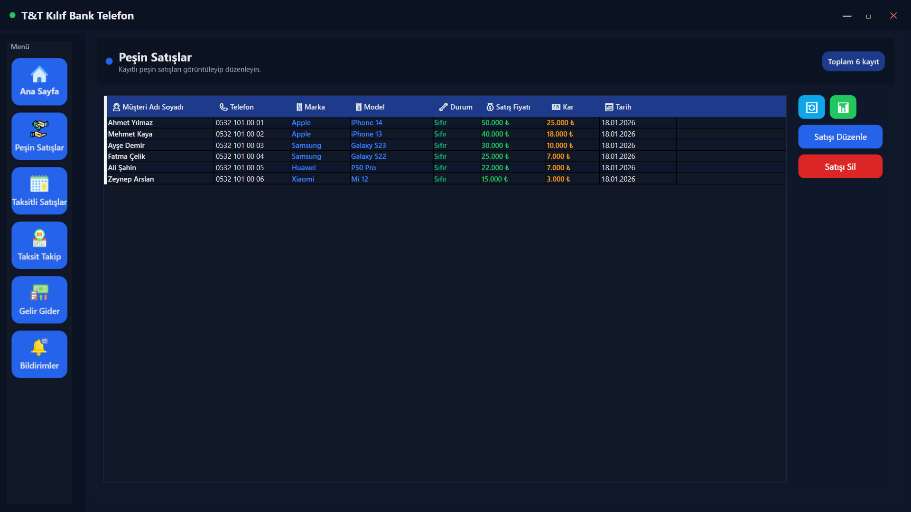
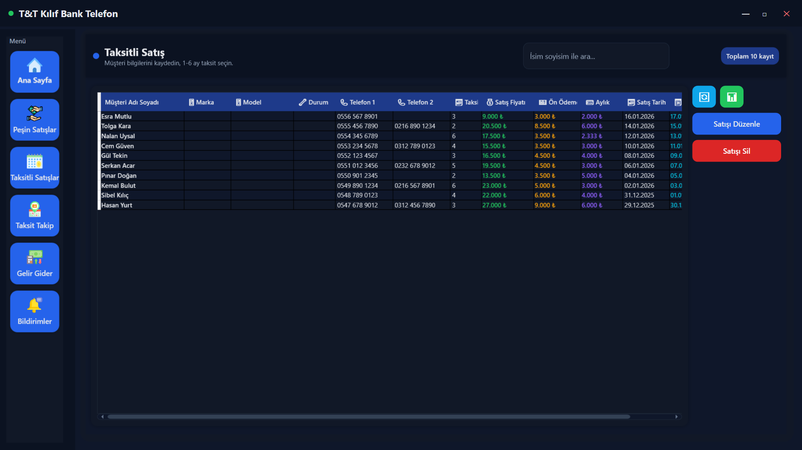
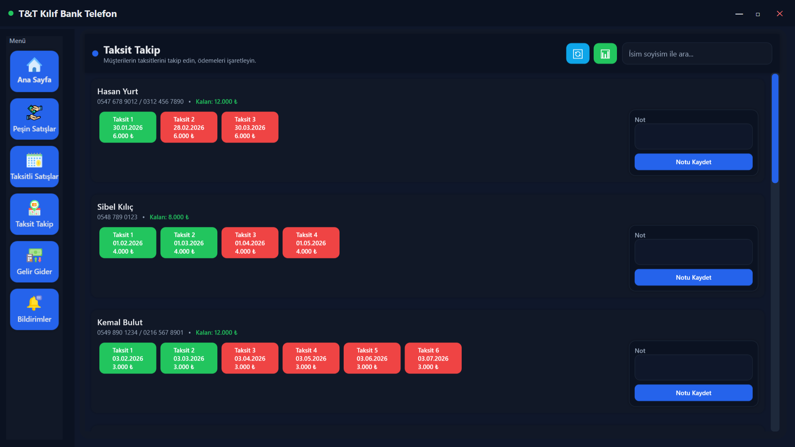
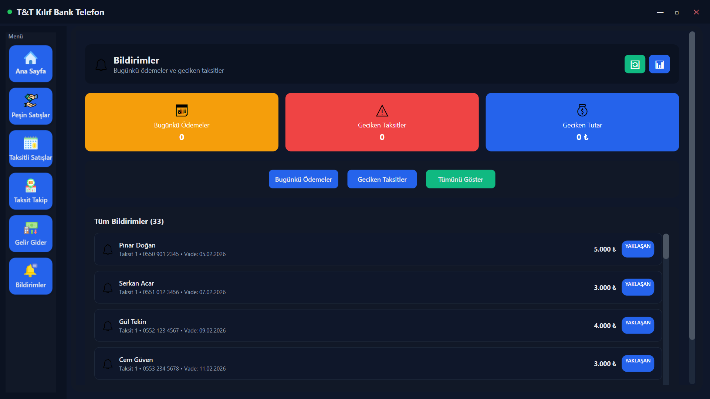

# 📱 Telefon Satış Uygulaması

Modern ve kullanıcı dostu bir telefon satış yönetim sistemi. Bu WPF uygulaması, telefon satış işletmeleri için envanter yönetimi, satış takibi, taksit yönetimi ve finansal analiz gibi temel işlevleri sunar.

## 🚀 Temel Özellikler

### 📋 Envanter Yönetimi
- **Telefon Kayıt Sistemi**: IMEI, marka, model, renk, garanti bilgileri
- **Akıllı Arama ve Filtreleme**: Hızlı telefon bulma
- **Durum Takibi**: Sıfır/İkinci el telefon yönetimi
- **Excel Dışa Aktarım**: Envanter raporları

### 💰 Satış İşlemleri
- **Peşin Satış**: Anında ödeme ile satış
- **Taksitli Satış**: Esnek taksit planları (1-6 ay)
- **Müşteri Yönetimi**: Detaylı müşteri bilgileri
- **Kar Hesaplama**: Otomatik kar marjı analizi

### 📅 Taksit Yönetimi
- **Ödeme Takibi**: Taksit durumları ve vade tarihleri
- **Hatırlatma Sistemi**: Bugün vadesi gelen ödemeler
- **Ödeme İşaretleme**: Tek tıkla ödeme güncelleme
- **Müşteri Notları**: Her müşteri için özel notlar

### 📊 Raporlama ve Analiz
- **Gelir-Gider Analizi**: Dönemsel finansal raporlar
- **Satış İstatistikleri**: Detaylı satış analizleri
- **Kar Marjı Takibi**: Karlılık hesaplamaları
- **Dışa Aktarım**: CSV ve Excel formatları

## 🖥️ Ekran Görüntüleri

### Ana Sayfa - Telefon Envanteri
Ana sayfa, telefon stokunuzu yönetmenizi ve hızlı işlemler yapmanızı sağlar.


**Özellikler:**
- Telefon listesi ve detaylı görünüm
- Arama ve filtreleme seçenekleri
- Hızlı işlem butonları (Ekle, Güncelle, Sil)
- Peşin ve taksitli satış başlatma
- Bugünkü hatırlatmalar paneli

### Peşin Satışlar
Nakit ödemeli satış işlemlerinin yönetimi.



**Özellikler:**
- Müşteri bilgileri girişi
- Satış fiyatı belirleme
- Otomatik kar hesaplama
- Satış geçmişi görüntüleme
- Excel dışa aktarım

### Taksitli Satışlar
Taksitli ödeme planları ile satış yönetimi.



**Özellikler:**
- Taksit sayısı belirleme (1-6 ay)
- Ön ödeme tutarı girişi
- Aylık ödeme hesaplama
- Müşteri iletişim bilgileri
- Taksit takvimi oluşturma

### Taksit Takip Sistemi
Taksitli satışların ödeme durumlarının takibi.



**Özellikler:**
- Müşteri bazında taksit görüntüleme
- Ödeme durumu güncelleme (Ödendi/Ödenmedi)
- Vade tarihi takibi
- Müşteri notları ekleme
- Geciken ödemeler vurgulama

### Bildirimler ve Hatırlatmalar
Önemli ödeme hatırlatmaları ve durum bilgileri.



**Özellikler:**
- Bugün vadesi gelen ödemeler
- Geciken taksitler listesi
- Yaklaşan vadeler
- Özet istatistikler
- Hızlı erişim linkleri

## 🛠️ Teknik Bilgiler

### Teknoloji Stack
- **Framework**: .NET 8.0 WPF
- **Programlama Dili**: C#
- **Veritabanı**: SQLite
- **UI**: Modern WPF tasarımı
- **Kütüphaneler**: System.Data.SQLite

### Sistem Gereksinimleri
- **İşletim Sistemi**: Windows 10/11 (64-bit)
- **.NET Runtime**: .NET 8.0 veya üzeri
- **RAM**: Minimum 4GB
- **Disk Alanı**: 200MB boş alan
- **Ekran Çözünürlüğü**: 1024x768 veya üzeri

### Veritabanı Yapısı
```sql
-- Ana tablolar
Telefonlar (Id, Imei, Model, Marka, Renk, GarantiAy, CikisYili, AlinanFiyat, Durum)
PesinSatislar (Id, TelefonId, MusteriAd, MusteriSoyad, MusteriTelefon, SatisFiyati, Kar, Tarih)
TaksitliSatislar (Id, TelefonId, MusteriAd, MusteriSoyad, Telefon1, Telefon2, TaksitSayisi, SatisFiyati, OnOdeme, AylikOdeme, Tarih)
TaksitOdemeleri (Id, TaksitliSatisId, TaksitNo, VadeTarihi, Odendi, OdemeTarihi)
TelefonAlislari (Id, TelefonId, Imei, Model, Marka, Renk, AlinanFiyat, Tarih)
```

## 📦 Kurulum ve Çalıştırma

### Geliştirici Kurulumu
```bash
# Projeyi klonlayın
git clone [repository-url]
cd TelefonSatısApp

# Bağımlılıkları yükleyin
dotnet restore

# Uygulamayı derleyin
dotnet build

# Uygulamayı çalıştırın
dotnet run
```

### Yayın Sürümü Oluşturma
```bash
# Windows için yayın sürümü
dotnet publish -c Release -r win-x64 --self-contained true

# Çıktı klasörü: bin/Release/net8.0-windows/win-x64/publish/
```

### İlk Kurulum
1. Uygulamayı ilk kez çalıştırdığınızda SQLite veritabanı otomatik oluşturulur
2. `Data/telefonlar.db` dosyası uygulama klasöründe saklanır
3. Örnek telefon verileri otomatik olarak yüklenir (20 adet)

## 🎯 Kullanım Kılavuzu

### Telefon Ekleme
1. Ana sayfada **"Telefon Ekle"** butonuna tıklayın
2. IMEI numarasını girin (15 haneli)
3. Marka ve model bilgilerini seçin
4. Renk, garanti süresi ve çıkış yılını belirleyin
5. Alış fiyatını girin
6. **"Kaydet"** butonuna tıklayın

### Peşin Satış İşlemi
1. Satılacak telefonu listeden seçin
2. **"Peşin Satış"** butonuna tıklayın
3. Müşteri bilgilerini doldurun
4. Satış fiyatını belirleyin (kar otomatik hesaplanır)
5. Satışı tamamlayın

### Taksitli Satış İşlemi
1. Telefonu seçin ve **"Taksitli Satış"** butonuna tıklayın
2. Müşteri bilgilerini girin (2 telefon numarası)
3. Taksit sayısını seçin (1-6 ay)
4. Satış fiyatı ve ön ödeme tutarını belirleyin
5. Aylık ödeme otomatik hesaplanır
6. Satışı tamamlayın

### Taksit Takibi
1. **"Taksit Takip"** sayfasına gidin
2. Müşteri listesinden ilgili kişiyi bulun
3. Taksit butonlarına tıklayarak ödeme durumunu güncelleyin
4. Gerekirse müşteri notu ekleyin
5. Arama özelliği ile hızlı müşteri bulma

## 🔧 Yapılandırma ve Yedekleme

### Veritabanı Yönetimi
- **Konum**: `Data/telefonlar.db`
- **Otomatik Yedekleme**: Henüz mevcut değil
- **Manuel Yedekleme**: Veritabanı dosyasını kopyalayın

### Güvenlik
- Veritabanı şifrelenmemiştir
- Hassas veriler için ek güvenlik önlemleri alın
- Düzenli yedekleme yapın

## 🐛 Sorun Giderme

### Sık Karşılaşılan Sorunlar

**Uygulama açılmıyor**
- .NET 8.0 Runtime'ın yüklü olduğundan emin olun
- Windows güncellemelerini kontrol edin

**Veritabanı hatası**
- `Data` klasörünün yazma izinleri olduğunu kontrol edin
- Veritabanı dosyasının bozuk olmadığını kontrol edin

**Taksit hesaplamaları yanlış**
- Satış fiyatı ve ön ödeme tutarlarını kontrol edin
- Taksit sayısının doğru seçildiğinden emin olun

## 📈 Gelecek Özellikler

### Planlanan Geliştirmeler
- 🔄 Otomatik veritabanı yedekleme
- 🔄 SMS hatırlatma entegrasyonu
- 🔄 Gelişmiş raporlama ve grafikler
- 🔄 Çoklu kullanıcı desteği
- 🔄 Bulut senkronizasyonu
- 🔄 Mobil uygulama entegrasyonu
- 🔄 Barkod okuyucu desteği

### Önerilen İyileştirmeler
- Veritabanı şifreleme
- Kullanıcı yetkilendirme sistemi
- Gelişmiş arama filtreleri
- Toplu işlem özellikleri

## 📞 Destek ve İletişim

### Teknik Destek
Bu uygulama açık kaynak bir proje değildir. Teknik destek için:
- Hata raporları ve öneriler için GitHub Issues kullanın
- Detaylı hata açıklaması ve ekran görüntüleri paylaşın

### Katkıda Bulunma
Proje kapalı kaynak olduğu için doğrudan kod katkısı mümkün değildir, ancak:
- Önerilerinizi paylaşabilirsiniz
- Hata raporları gönderebilirsiniz
- Kullanım deneyimlerinizi paylaşabilirsiniz

## 📄 Lisans ve Telif Hakkı

Bu yazılım özel mülkiyettir. Ticari kullanım için lisans gereklidir.

**© 2024 Telefon Satış Uygulaması. Tüm hakları saklıdır.**

---

## 📊 Proje İstatistikleri

- **Kod Satırı**: ~3,000+ satır C#
- **Dosya Sayısı**: 30+ dosya
- **Ana Özellik**: 12+ temel özellik
- **Veritabanı Tablosu**: 5 ana tablo
- **Desteklenen Format**: SQLite, CSV

### Sürüm Bilgisi
- **Mevcut Sürüm**: v1.0.0
- **Son Güncelleme**: 2024
- **Uyumluluk**: Windows 10/11, .NET 8.0

---

*Bu README dosyası uygulamanın mevcut durumunu yansıtmaktadır. Güncellemeler için düzenli olarak kontrol edin.*